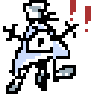

<!-- ==================== MASCOT ==================== -->

<!-- ==================== HEADER ==================== -->

 

<!-- ==================== WEBSITE (highlighted) ==================== -->
### 🌐 [**my website （´ω｀♡%）**](https://rokokol.github.io/)

---

## 🧑‍💻 About me

- 🔬 Enthusiast who lives between **Python/ML**, **microcontrollers** and a soldering iron
- 🖨️ I design and 3D-print things and build hardware on **Arduino / ESP32**
- 🐧 Sigma **Linux / Wayland** user, riced around **Hyprland**
- 🤖 Big on **self-hosting** and **local AI** (Ollama, Open WebUI, ComfyUI)
- 🎬 On the side: video, photo, pixel art and 3D

---

## 🛠️ Tech Stack

**🧮 Languages**

**📊 Data Science / ML**

**🤖 Local AI / LLM**

**🧰 Dev / Infra**

**🖨️ 3D · CAD · Electronics**

**🎨 Media / Creative**

**🐧 Linux / Rice** &nbsp;·&nbsp; [**huix** (*≧m≦*)](https://github.com/rokokol/huix)

**🗄️ Databases**

**☁️ Self-hosted**

**🗂️ Productivity**

---
  

