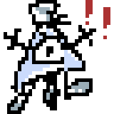

  
  

## 🧑‍💻 About me

- 🔬 Enthusiast who lives between **IT** and a **soldering iron**
- 🖨️ I design and 3D-print things and build hardware on **Arduino / ESP32**
- 🐧 Sigma **Linux / Wayland** user, riced around **Hyprland**
- 🤖 Big on **self-hosting** and **local AI** (Ollama, Open WebUI, ComfyUI, Headscale, Dovecot+Postfix)
- 🎬 On the side: video, photo, pixel art and 3D

<!---->
<!--
-->
<!--

-->

  

